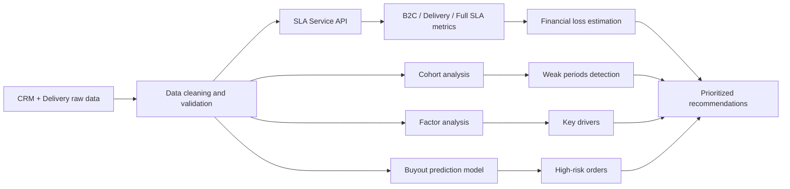

# Conceptual scheme

```mermaid
flowchart LR
    A[CRM + Delivery raw data] --> B[Data cleaning and validation]
    B --> C[SLA Service API]
    C --> D[B2C / Delivery / Full SLA metrics]
    B --> E[Cohort analysis]
    B --> F[Factor analysis]
    B --> G[Buyout prediction model]
    D --> H[Financial loss estimation]
    E --> I[Weak periods detection]
    F --> J[Key drivers]
    G --> K[High-risk orders]
    H --> L[Prioritized recommendations]
    I --> L
    J --> L
    K --> L
```
